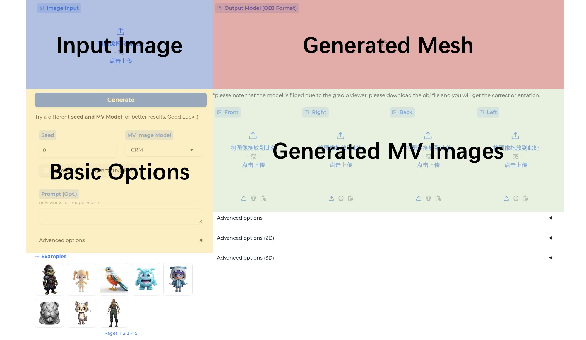
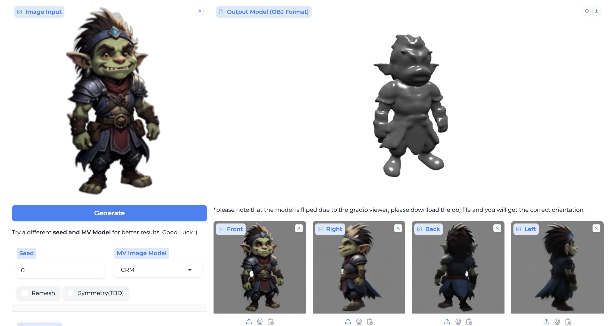
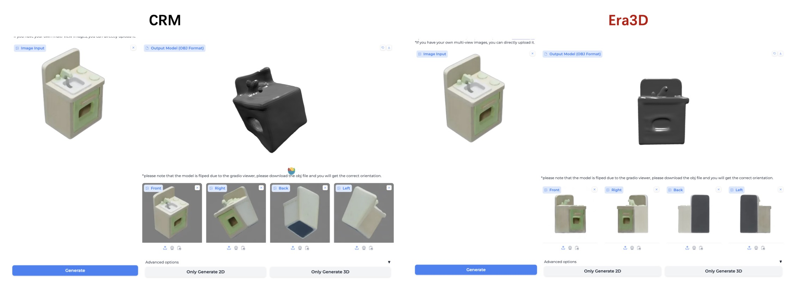
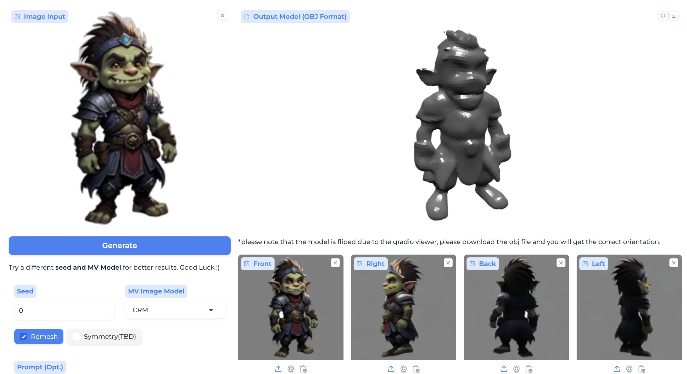
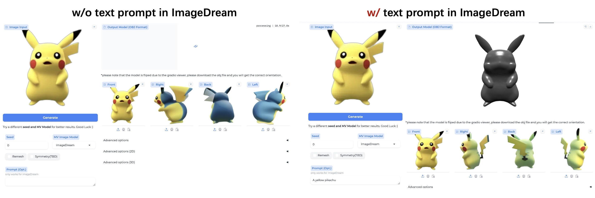

[中文版](tutorial_zh.md)
## Best Practice of CraftsMan3D :notebook:

### Overview

  

**CraftsMan (aka 匠心)** is a two-stage text/image to 3D mesh generation model. The first stage is perfomed using a 3D native diffusion that can genrate a coarse mesh with smooth geometry within 5s. The second stage is a powered by a 2D normal diffusion model that enhance the multi-view coarse normal maps.
In the [Huggingface demo](https://huggingface.co/spaces/wyysf/CraftsMan),
we provide the process of the first stage.

### Baisc Usage

#### Step 1: Upload your reference image
You can upload your own image by clicking the blue area, or you can choose the example images below the page to have a quickly test.

#### Step 2: Click Generate
Just clicking the `Generate` button, we will first generate multi-view images according to the input, which shows at the green area. Subsequently, it proceeds to generate the mesh, which is indicated in the red section.

  

#### Different MV models
Image-to-MV (Multi-View) models play a crucial role in our pipeline, as they enable us to leverage 2D priors effectively to address the challenges associated with limited 3D data in the generation process. We offer a variety of options, each with its own distinct advantages and characteristics.

##### [CRM](https://github.com/thu-ml/CRM)
We choose CRM as the default multi-view (MV) model due to its lightweight nature and its superior alignment with the distribution of our 3D diffusion models compared to other options. This alignment typically yields better results in the majority of situations.

##### [Era3D](https://github.com/pengHTYX/Era3D)
Era3D is an advanced version of [Wonder3D](https://github.com/xxlong0/Wonder3D/tree/main), employing a higher resolution and introducing a novel approach to address perspective distortion issues. This capability allows it to effectively manage scenarios where the image view is at an extreme angle. But it takes more time to generate.

  

##### [ImageDream](https://github.com/3DTopia/LGM)
ImageDream was originally proposed in [repo.](https://image-dream.github.io/), 
but we use another finetuned version proposed by [LGM](https://github.com/3DTopia/LGM), 
which is more robust and can produce more detailed results.

#### Remesh
We use [Instant Meshes](https://github.com/wjakob/instant-meshes/tree/master) to remesh the generated mesh to a quadrilateral one with 2000 faces, thereby highlighting the smoothness of our generated geometry. 
By selecting the remesh option, you will obtain the remeshed meshes with regular topology.

  

#### Use text promt
The [ImageDream](https://github.com/3DTopia/LGM) also facilitates the use of text prompts as input, which significantly enhances the detail and accuracy of multi-view (MV) predictions. This feature is particularly effective for refining the depiction of the object's rear view.

  

#### Different Seed

By default, the system utilizes a seed value of 0, indicating that a random seed is employed for generation. To achieve more consistent and predictable results, you have the option to set a specific seed for the generation process.

#### Tips to get better results
- try to use the front view image of the object;
- use different text-to-MV models;
- try different paramters;

### Advanced Options

#### Only Generate 2D
You can only generate multi-view images with this button.

#### Only Generate 3D
You can only generate the mesh by this button, please note that you have to generate or upload the multi-view images first.*
**This button is useful when you want to use your uploaded multi-view images.**

### Advanced Options (2D)

#### Backgroud Choice

`Alpha as Mask`: use the alpha channel of the image as the mask.
`Auto Remove Background`: use different methods to automatically remove the background.
`Original Image`: use the original image.

#### Backgroud Remove Type
We provide two ways [rembg](https://github.com/danielgatis/rembg) and [sam](https://github.com/facebookresearch/segment-anything) to remove the background color. SAM may require more time for processing but provides a higher accuracy in foreground segmentation. If you encounter issues with obtaining the correct foreground using the default rembg, we recommend trying SAM.

#### Backgroud Color
For the CRM model, it is recommended to use a gray background color, which we have manually set as the default. For the remaining multi-view (MV) models, a white background suffices for the majority of scenarios.

### Advanced Options (3D)

#### Octree Depth
The Marching Cubes algorithm utilizes a resolution parameter; a value of 7 corresponds to 2^7 voxels. For generating meshes with higher precision, please adjust this value accordingly.

### Q&A

#### Q1. WHY the output mesh seemed not exactly be consistent with the reference images?
Our 3d diffusion is a generative model that takes images as reference (compared with the reconstruction model that builds the 3D mesh from sparse views), so the generated meshes are not fully aligned with the input one.
To tackle this, you can try the below methods:
Use the front view image of the object as input, such that you will get more accurate multi-view prediction;
Try another seed and mv_models, such as ImageDream prone to produce axis-aligned multi-view images;
We will increase the alignment between the generated mesh and the input image, by introducing more accurate condition features in future work.

#### Q2. WHY the output mesh seemed not to have the texture?

Hi, our current work focuses on high-quality mesh generation without paying much attention to textures. We will consider this direction in our next project. In the current state, we can use some great texture generation work to achieve this, such as: [DreamMat](https://github.com/zzzyuqing/DreamMat?tab=readme-ov-file), [TEXTure](https://github.com/TEXTurePaper/TEXTurePaper), [SyncMVD](https://github.com/LIU-Yuxin/SyncMVD), [Fantasia3D](https://github.com/Gorilla-Lab-SCUT/Fantasia3D) etc.
